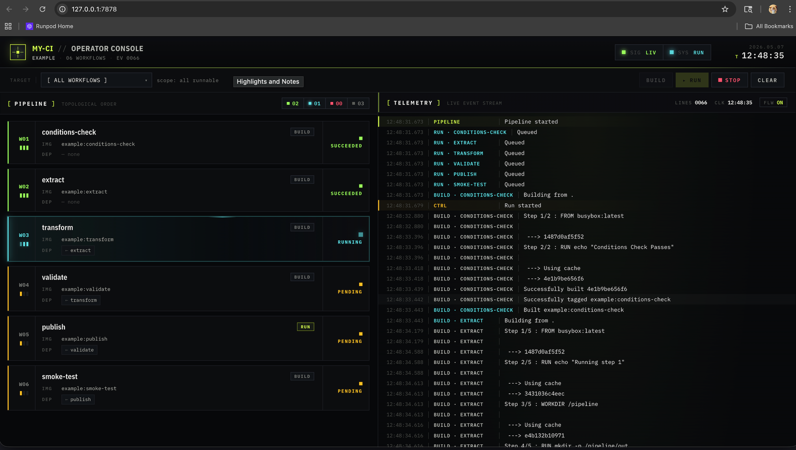

# my-ci




Run local CI/CD workflows over an OCI socket (Docker or Podman).

## Demo

```sh
git clone https://github.com/geoffsee/my-ci.git
cd my-ci
cd ui
npm install
npm run build
cd ..
cargo run -- gui --port 7878
```

Then open `http://127.0.0.1:7878`, click `Run`, and watch the pipeline execute in realtime.

## Install

```sh
cargo binstall my-ci
```

## Quickstart

```sh
my-ci init        # scaffold ./my-ci
my-ci run         # build + run the pipeline
```

## Commands

| Command | Args                                   | Description                                                              |
| ------- | -------------------------------------- | ------------------------------------------------------------------------ |
| `init`  | `[PATH]` (default `my-ci`), `--force`  | Scaffold the embedded template into `PATH`. Skips existing unless force. |
| `build` | `[WORKFLOW]`                           | Build one workflow + deps, or all workflows when omitted.                |
| `run`   | `[WORKFLOW]`                           | Build deps, then run workflows that have a `command`. All when omitted.  |
| `list`  | —                                      | Print workflow names from config.                                        |

Global: `-c, --config <PATH>` (default `my-ci/workflows.toml`).

## `workflows.toml` schema

```toml
name      = "string"          # project name; used as image prefix (default "my-ci")
env_file  = "path"             # optional; loaded via dotenvy before run, relative to config

[[workflow]]
name         = "string"        # required; unique
context      = "path"          # build context; default "."
instructions = "string"        # inline Containerfile OR path ending in .Containerfile
image        = "string"        # optional override; default "{name}:{workflow.name}"
depends_on   = ["string"]      # build order; topologically sorted
env          = ["KEY=VALUE"]   # container env at run time
command      = ["argv"]        # required to run; build-only if omitted
```

Dependencies build in topological order. A workflow without `command` is build-only and is skipped by `run`.
